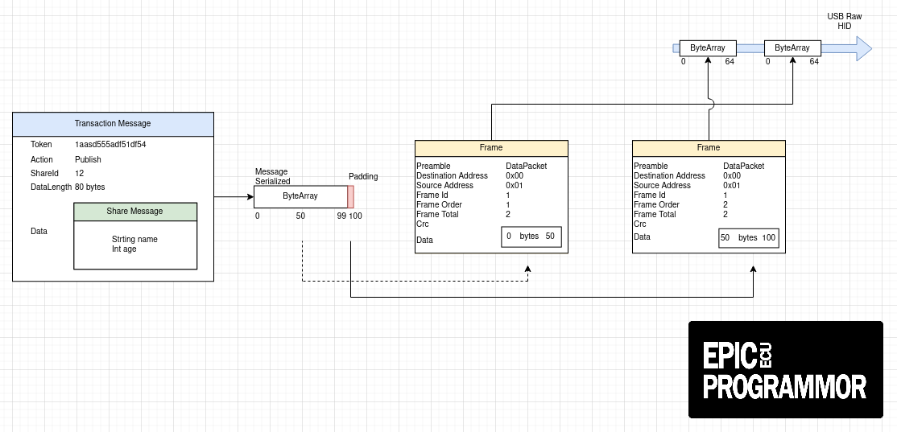

<div align="center">


##### An open source tuning software communication adapter collection

</div>

[](https://github.com/epicecu/programmor-adapters/actions/workflows/tests.yml)

## Notes
- The Gevent webserver is preferred over the eventlet server due to the server emit function failing to work and causing the server to restart, generating a new session id.  

## Install

Clone the repo and install dependencies:

Linux/Mac

sudo apt-get install -y libhidapi-dev

```bash
git clone --branch master https://github.com/epicecu/programmor.git
cd programmor
make venv
make install-dev
```

Windows

```bash
git clone --branch master https://github.com/epicecu/programmor.git
cd programmor
virtualenv venv
venv\Scripts\activate
pip install -e .
pip install -r requirements.txt
pip install -r requirements_dev.txt
```

## Starting Development

```bash
make run
```
## Compiling the Protobuf files

```bash
make compile-proto
```

## Run tests

```bash
make test
```

Note: Your system will need to have the 3.10 python environment installed
```bash
make tox
```

## Packaging for Production

To package app for the local platform:

```bash
make installer
```
This will generate an executable in /dist

## Docs

While in the python virtual environment, navigate to `/documentation` and run the command `make html`
View the docs in the browser by running `make docsrun`

### Communications Flow Chart



## Donations

**Donations will ensure the following:**

- 🔨 Long term maintenance of the project
- 🛣 Progress on the [roadmap](https://epicecu.com/programmor/roadmap)
- 🐛 Quick responses to bug reports and help requests

## Maintainers

- [David Cedar](https://github.com/devvid)

## License

GPL V2 © [Programmor](https://github.com/epicecu/programmor)

## Todo

In no particular order

1. Fix delay in message emits from Adapter to HMI
2. Test with multiple USB devices connected
3. Test on Windows 10, 11
4. Test on Mac
5. Increase code coverage with unit tests
6. Update documentation
7. Replace local database with sqlite
